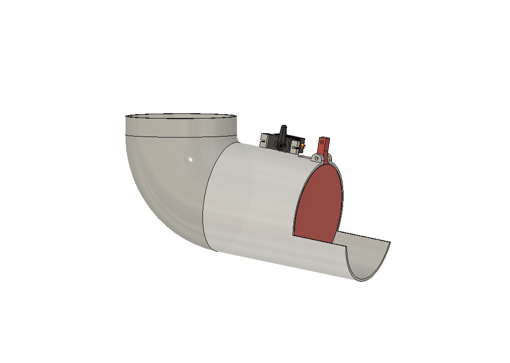
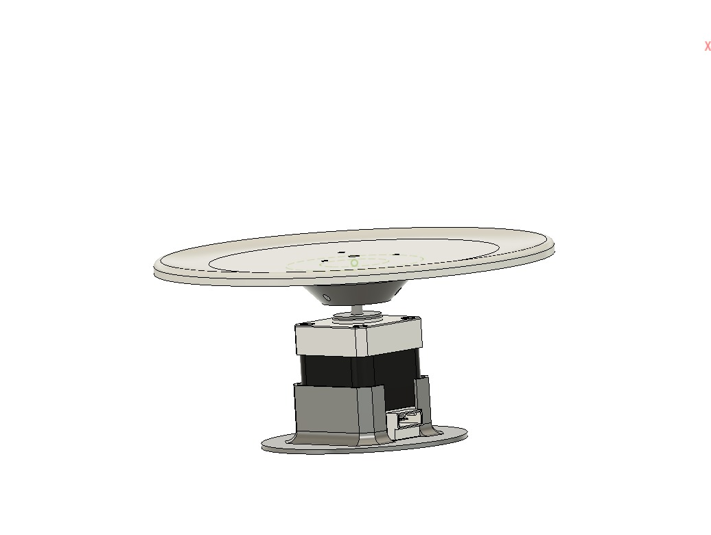

<div align="center">

# AgriScan 360

**Multi-Spectral 360 Produce Freshness Inspection System**

[](https://www.uiu.ac.bd/)
[](https://www.uiu.ac.bd/)
[]()
[]()
[]()

*Sealed inspection chamber using RGB imaging, 365 nm UV-A fluorescence, and BME688 VOC gas sensing — with an SG90 pipe feeder door, 8-stop 360 degree turntable, and real-time web dashboard.*

</div>

---

## What This System Does (and Does NOT Do)

**Does:**
- Drop a produce item into the sealed chamber via an SG90 servo-controlled pipe door
- Rotate the item 360 degrees (8 x 45 degree stops) capturing 16 images (8 RGB + 8 UV)
- **Simultaneously** sniff VOC gas with BME688 while the turntable scan runs
- Classify the item as **HEALTHY**, **ROTTEN**, or **UNCERTAIN** using multi-modal AI fusion
- Stream results live to a web dashboard over Wi-Fi LAN
- Auto-export scan data to a training CSV after every scan

**Does NOT:**
- Automatically sort or eject produce — the operator **manually picks up** the item after inspection
- Use a conveyor belt or diverter gate (planned for Stage 2)
- Use a trained ONNX model yet — the classifier is rule-based (AI fusion of heuristics)

---

## System Architecture

```
+-------------------------------+     Wi-Fi LAN      +-------------------------------------------+
|    RASPBERRY PI 5  (Edge)     | -----------------> |       LAPTOP  (AI Server)                 |
|                               |  HTTP POST /api/scan|                                           |
|  - NEMA 17 + A4988 stepper    |  16 images + gas    |  - FastAPI + Uvicorn (port 8000)          |
|  - White LED Array (IRLZ44N)  |                     |  - SQLite via SQLAlchemy ORM              |
|  - 365nm UV-A (IRLZ44N)       | <----------------- |  - Rule-based AI classifier (3-pillar)    |
|  - RPi Camera Module 2 (8MP)  |  JSON result        |  - WebSocket live dashboard push          |
|  - BME688 Gas Sensor (I2C)    |                     |  - Web UI at http://<laptop-ip>:8000      |
|  - SSD1306 OLED 0.96" (I2C)  |                     |                                           |
|  - SG90 Servo (Pipe door)     |                     |                                           |
+-------------------------------+                     +-------------------------------------------+
```

---

## Three Detection Pillars

| Pillar | Sensor | What It Detects |
|--------|--------|-----------------|
| **P1 -- RGB Surface** | Camera + White LEDs | Browning, necrosis, bruising, calyx decay |
| **P2 -- UV Fluorescence** | Camera + 365 nm UV-A | Fungal mould (glows green/yellow), aflatoxin |
| **P3 -- Gas / VOC** | BME688 | Internal rot, core decay, ethylene, ethanol emission |

**Fusion weights:** `0.40 * P1 + 0.35 * P2 + 0.25 * P3`

**Gas override rule:** If fused score < 0.40 (would be HEALTHY) BUT gas score >= 0.70, system overrides to ROTTEN (catches internal decay that looks visually clean).

> **One scan = 16 frames:** 8 RGB x 8 angles + 8 UV x 8 angles at 45 degree increments.

---

## Classification Output

| Status | Meaning |
|--------|---------|
| `HEALTHY` | All three pillars agree the item is fresh |
| `ROTTEN` | Decay detected by visual and/or gas pillars |
| `UNCERTAIN` | Conflicting signals -- borderline case |

The `rot_suspicion` field (BME688-only, Pi-side) is separate metadata; it does **not** drive the final result.

---

## Gas Thresholds (Binary -- ROTTEN if breached)

| Produce | Ratio Threshold | Delta Threshold |
|---------|-----------------|-----------------|
| Tomato | >= 15.0 % drop | >= 5.5 kOhm drop |
| Apple | >= 18.0 % drop | >= 7.0 kOhm drop |
| Eggplant | >= 12.0 % drop | >= 4.5 kOhm drop |
| Default | >= 16.0 % drop | >= 6.0 kOhm drop |

---

## Project Structure

```
AgriScan360/
|
+-- pi_client/                    Runs on Raspberry Pi 5
|   +-- config.py                 GPIO pins, server URL, motor/camera/gas settings
|   +-- motor.py                  NEMA 17 + A4988 stepper controller
|   +-- lights.py                 White + UV-A LED switching via IRLZ44N MOSFETs
|   +-- gas_sensor.py             BME688 I2C driver + baseline/delta classification
|   +-- camera.py                 Picamera2 controller (RGB + UV pair, ROI crop)
|   +-- display.py                SSD1306 OLED I2C driver
|   +-- servo.py                  SG90 servo driver (pipe feeder door)
|   +-- uploader.py               HTTP multipart POST to laptop server
|   +-- main.py                   Master scan orchestrator (848 lines)
|   +-- .demo_step                Tracks showcase demo scan index (1 or 2)
|   +-- requirements_pi.txt
|
+-- laptop_server/                Runs on HP Victus 16 Laptop (Windows)
|   +-- main_server.py            FastAPI app entry point + WebSocket manager
|   +-- config.py                 Server host, DB path, AI thresholds
|   +-- database.py               SQLAlchemy SQLite engine + session
|   +-- models.py                 ORM: Scan + ScanImage tables
|   +-- schemas.py                Pydantic request/response schemas
|   +-- ai_engine.py              Multi-modal classifier (rule-based, ONNX slot ready)
|   +-- demo_queue.json           Showcase demo queue (armed for video recording)
|   +-- routers/
|   |   +-- scan.py               POST /api/scan + demo queue intercept + auto CSV sync
|   |   +-- history.py            GET /api/history, stats, DELETE
|   +-- static/
|   |   +-- index.html            Dark industrial dashboard UI
|   |   +-- css/style.css         Custom dark theme + animations
|   |   +-- js/app.js             WebSocket client + table rendering
|   |   +-- scans/                Saved scan images: scans/{scan_id}.{Produce}/
|   +-- models/                   ONNX model slot (empty -- place model here when trained)
|   +-- db/
|   |   +-- agriscan360.db        SQLite database (auto-created on first run)
|   +-- requirements_laptop.txt
|
+-- tools/                        Utility scripts (run from project root)
|   +-- export_training_data.py   Export all scans to CSV (also called automatically)
|   +-- set_demo_mode.py          Arm / disable / check showcase demo queue
|   +-- generate_report.py        Generate LaTeX + PDF final engineering report
|   +-- run_bme_diagnostic.py     BME688 diagnostic/calibration tool
|   +-- test_camera.py            Camera capture test
|   +-- test_lights.py            LED toggle test
|   +-- test_motor.py             Stepper motor test
|   +-- test_servo.py             Servo angle sweep test
|   +-- test_oled.py              OLED display test
|
+-- training/                     Model training scripts
|   +-- train_agriscan360.py      Main training pipeline
|   +-- train_bme_only.py         BME688-only gas model training
|   +-- vision_classifier/        EfficientNet-B3 vision model training
|
+-- datasets/                     Training data
|   +-- bme688_telemetry_dataset.csv   Auto-exported scan telemetry (13+ scans)
|   +-- timeseries/               Raw per-second BME688 timeseries logs
|
+-- reports/                      Final engineering report
|   +-- AgriScan360_Final_Report.pdf   6-page PDF (compiled with ReportLab)
|   +-- AgriScan360_Final_Report.tex   Full LaTeX source
|   +-- video_demo_script.txt     Spoken video demo script
|
+-- AgriScan360_Final_Report.pdf  Root copy for quick access
+-- start_server.bat              One-click laptop server launcher (Windows)
+-- start_pi.sh                   Pi client launcher
+-- video_demo_script.txt         Spoken video demo script (root copy)
+-- README.md
```

---

## Hardware Bill of Materials

| Component | Details | Approx. Cost (BDT) |
|-----------|---------|-------------------|
| Raspberry Pi 5 (4 GB) | Edge compute + GPIO control | 13,000 -- 20,000 |
| NEMA 17 Stepper Motor | 1.8 deg/step, 200 steps/rev | ~800 |
| A4988 Stepper Driver | Microstepping driver module | ~200 |
| SG90 Micro Servo | Pipe feeder door actuator | ~150 |
| BME688 Gas Sensor | VOC, temp, humidity (I2C, 0x77) | ~1,500 |
| SSD1306 OLED 0.96" | Status display (I2C, 0x3C) | ~250 |
| RPi Camera Module 2 | 8MP, 1080p (RGB + UV capture) | ~2,500 |
| 365 nm UV-A LED Array | Fluorescence illumination | ~300 |
| White LED Array | RGB illumination | ~200 |
| IRLZ44N MOSFETs (x2) | LED switching (logic-level) | ~100 |
| 12V PSU | Motor + LED power supply | ~600 |
| 3.7V LiPo / Battery | Backup / portable power | ~400 |
| 27L Sealed Container | Matte-black inspection chamber | ~500 |
| Miscellaneous (resistors, wires, PCB, PLA+ turntable) | | ~490 |
| **Total (estimated)** | | **~24,990 BDT** |

---

## GPIO Pin Reference

### A4988 Stepper Driver

| Signal | BCM GPIO | Physical Pin |
|--------|----------|-------------|
| STEP | GPIO 17 | Pin 11 |
| DIR | GPIO 27 | Pin 13 |
| ENABLE | GPIO 22 | Pin 15 |
| RST + SLP | Bridge together | -- |
| VMOT | 12V PSU (+) | -- |
| GND | 12V PSU (--) + Pi GND | -- |

> ENABLE is active LOW: `off()` = motor coils ON, `on()` = coils de-energized.

### IRLZ44N LED MOSFETs

| LED Array | Gate GPIO (BCM) | Physical Pin |
|-----------|----------------|-------------|
| White LED Array | GPIO 18 | Pin 12 |
| 365 nm UV-A Array | GPIO 24 | Pin 18 |

> Wiring: LED (+) to power rail, LED (--) to Drain, Gate to GPIO + 10 kOhm pull-down, Source to GND.

### SG90 Servo (Pipe Feeder Door)

| Signal | GPIO (BCM) | Physical Pin | Notes |
|--------|-----------|-------------|-------|
| PWM | GPIO 23 | Pin 16 | 90 deg = CLOSED, 180 deg = OPEN |

### I2C Bus (shared SDA/SCL)

| Device | SDA | SCL | Address |
|--------|-----|-----|---------|
| BME688 Gas Sensor | GPIO 2 (Pin 3) | GPIO 3 (Pin 5) | `0x77` |
| SSD1306 OLED 0.96" | GPIO 2 (Pin 3) | GPIO 3 (Pin 5) | `0x3C` |

### NEMA 17 to A4988 Wiring

| Motor Pin | A4988 Terminal |
|-----------|---------------|
| Pin 1 (leftmost) | 1A |
| Pin 2 | Skip/Empty |
| Pin 3 | 1B |
| Pin 4 | 2A |
| Pin 5 | Skip/Empty |
| Pin 6 (rightmost) | 2B |

---

## Quick Start

### Step 1 -- Start the Laptop Server

```bash
# From the AgriScan360 root directory (Windows PowerShell):
cd laptop_server
python -m uvicorn main_server:app --host 0.0.0.0 --port 8000 --reload
```

Or use the one-click launcher:
```bash
start_server.bat
```

Open **http://10.210.73.32:8000** in your browser. Dashboard appears immediately.

> Current server IP: `10.210.73.32`. Update `pi_client/config.py` if your laptop IP changes.

### Step 2 -- Start the Pi Client

```bash
# On the Raspberry Pi (from /home/micro/Desktop/LAST/AgriScan360/):
python3 pi_client/main.py
```

The Pi will:
1. Connect to the server health check endpoint
2. Ask you to select produce type (Tomato / Apple / Eggplant)
3. Run 3-minute empty-chamber gas baseline
4. Wait for you to drop produce via the pipe
5. Open the servo door for 2 seconds, then close
6. **Simultaneously** run 8-stop turntable scan (16 photos) + BME688 sniffing
7. Upload results to laptop; show classification on OLED + dashboard
8. **Stop and wait** -- you manually pick up the item, then press Enter for next scan

### Step 3 -- Pi Client Flags

| Flag | Effect |
|------|--------|
| `python3 pi_client/main.py` | Normal operation |
| `python3 pi_client/main.py --demo` | Showcase demo mode (auto-produce: Scan 1=Tomato, Scan 2=Apple) |
| `python3 pi_client/main.py --produce Tomato` | Skip produce selection prompt |
| `python3 pi_client/main.py --simulate` | Simulate hardware (no real GPIO required) |
| `python3 pi_client/main.py --no-loop` | Run exactly one scan then exit |

---

## Scan Workflow (Detailed)

```
[A] Server health check
    |
[B] Produce selection --> Servo OPEN (180 deg, 2 sec) --> Servo CLOSE (90 deg)
    |
[C] 3-min incubation [SIMULTANEOUS]:
    |---- BME688 sniffing thread starts (samples every 0.5 sec)
    |---- 8-stop turntable scan begins:
    |         Stop 1: settle 1.5s -> White LEDs -> RGB snap -> UV LEDs -> UV snap
    |         Stop 2-8: same, motor advances 45 deg each stop
    |---- After 16 photos done: wait for remaining incubation time
    |---- Ctrl+C to skip remaining wait
    |
[D] Sniffing stops --> gas_result computed
    |
[E] Upload: multipart POST (16 JPEG + gas telemetry) --> laptop
    |
[F] Server: check demo_queue.json --> AI classify --> store SQLite --> WebSocket push
    |
[G] Pi displays result on OLED
    |
[H] STOP -- Operator manually picks up produce --> press Enter to scan next item
```

---

## Showcase Demo Mode (For Video Recording)

Guarantees two specific results regardless of actual sensor readings:

```bash
# On the laptop -- arm the demo queue:
python tools/set_demo_mode.py --enable

# Check status:
python tools/set_demo_mode.py --status

# Disable (return to normal AI mode):
python tools/set_demo_mode.py --disable

# On the Pi -- run demo:
python3 pi_client/main.py --demo
```

**Demo scan sequence:**

| Scan | Produce | Result | Confidence |
|------|---------|--------|-----------|
| 1 | Tomato | HEALTHY | 70% |
| 2 | Apple | ROTTEN | 100% |

After both scans complete, the server automatically returns to normal AI classification mode.

---

## Web Dashboard

**URL:** `http://10.210.73.32:8000`

Features:
- Live scan result push via WebSocket (`/ws/live`)
- Scan history table with filters by produce and status
- Per-scan image viewer (16 images: 8 RGB + 8 UV)
- Gas telemetry display (kOhm resistance, temperature, humidity)
- Ground truth labelling per scan (for training data collection)
- Aggregate stats (total scans, healthy %, rotten % per produce)

---

## API Reference

| Method | Endpoint | Description |
|--------|----------|-------------|
| `GET` | `/` | Web dashboard |
| `GET` | `/api/health` | Server health check |
| `POST` | `/api/scan` | Ingest scan (multipart: 16 images + gas fields) |
| `GET` | `/api/history` | Paginated history (`?page=1&limit=20&produce=Tomato&status=ROTTEN`) |
| `GET` | `/api/scan/{id}` | Full scan detail with image URLs |
| `GET` | `/api/stats` | Aggregated stats |
| `DELETE` | `/api/scan/{id}` | Delete scan + image files |
| `POST` | `/api/scan/{id}/ground_truth` | Set ground truth label (triggers CSV export) |
| `WS` | `/ws/live` | Real-time result push |
| `GET` | `/docs` | Swagger UI |
| `GET` | `/redoc` | ReDoc API docs |

---

## Database Schema

```
scans
+-- id              INTEGER  PRIMARY KEY
+-- produce_name    TEXT     (Tomato, Apple, Eggplant)
+-- status          TEXT     HEALTHY | ROTTEN | UNCERTAIN | PENDING
+-- confidence      REAL     0.0 to 100.0 %
+-- reason          TEXT     Human-readable explanation
+-- gas_delta       REAL     kOhm resistance drop (BME688)
+-- rot_suspicion   TEXT     HEALTHY | ROTTEN (BME688-only, Pi-side metadata)
+-- temperature_c   REAL
+-- humidity_pct    REAL
+-- model_used      TEXT     rule_based_v1 | onnx_agriscan360_v1
+-- ground_truth    TEXT     HEALTHY | ROTTEN (manually labelled, for training)
+-- created_at      DATETIME

scan_images  (16 rows per scan)
+-- id          INTEGER  PRIMARY KEY
+-- scan_id     INTEGER  FK -> scans.id
+-- angle_deg   INTEGER  0, 45, 90, 135, 180, 225, 270, 315
+-- light_type  TEXT     rgb | uv
+-- filename    TEXT     e.g. rgb_045.jpg
+-- url_path    TEXT     /static/scans/{scan_id}.{Produce}/rgb_045.jpg
```

---

## Training Data Export

The CSV auto-exports silently after every scan and after every ground truth label update.

```bash
# Manual export (from project root, on laptop):
python tools/export_training_data.py

# Output: datasets/bme688_telemetry_dataset.csv
```

---

## Report Generation

```bash
# From project root:
python tools/generate_report.py

# Outputs:
#   reports/AgriScan360_Final_Report.pdf
#   reports/AgriScan360_Final_Report.tex
#   AgriScan360_Final_Report.pdf  (root copy)
```

---

## Chamber Specs

| Parameter | Value |
|-----------|-------|
| Dimensions | L: 11" x W: 17" x H: 9" (~27.6 L) |
| Interior finish | Matte black (no reflections) |
| Camera | RPi Camera Module 2, side wall, ~35 degree downward tilt |
| Camera ROI | Left=25%, Top=41%, Right=76%, Bottom=100% (crops background) |
| Turntable | 7" diameter, PLA+ 3D printed disc on NEMA17 shaft |
| Motor mount | Under-floor (only shaft pokes through) |
| Scan geometry | 8 stops x 45 deg = 360 deg |
| Entry pipe | 90-degree PVC elbow, 7" straight section, 3.5" inner diameter |
| Feeder door | SG90 servo-controlled circular flap (OPEN=180 deg, CLOSE=90 deg) |

---

## Hardware Photos

### Pipe Feeder with SG90 Servo Door

> 7-inch straight PVC section (3.5" inner diameter) with a 90-degree elbow inlet.
> The red circular flap door is driven by the SG90 servo mounted on top.
> Produce is dropped in from the top elbow and released into the chamber when the door opens.



### 360-Degree Turntable (NEMA17 + PLA+ Disc)

> 7-inch PLA+ 3D-printed turntable disc mounted directly on the NEMA17 stepper shaft.
> The motor sits below the chamber floor; only the shaft protrudes through.



---

## Camera ROI / Crop

The camera crops each frame to focus on the turntable, removing background walls and the feeder chute.

```python
# In pi_client/config.py:
CAMERA_CROP_ENABLED = True
CAMERA_ROI_CROP     = (0.25, 0.41, 0.76, 1.00)  # (left, top, right, bottom) normalized
```

---

## Supported Produce

| # | Produce | Gas Profile Available |
|---|---------|----------------------|
| 1 | Tomato | Yes |
| 2 | Apple | Yes |
| 3 | Eggplant | Yes |

> Only these three are currently supported. The system prompts for produce selection at scan start.

---

## Roadmap

### Stage 1 (Complete -- This Repo)

- [x] Sealed matte-black inspection chamber (27 L)
- [x] 8-angle stepper motor turntable
- [x] White LED + 365 nm UV-A LED dual-spectral capture
- [x] BME688 VOC gas sensing with per-produce thresholds
- [x] SG90 servo pipe feeder door
- [x] SSD1306 OLED status display
- [x] Camera ROI center crop (calibrated to turntable)
- [x] FastAPI laptop server + SQLite DB
- [x] Real-time WebSocket dashboard
- [x] Binary HEALTHY / ROTTEN classification (rule-based 3-pillar fusion)
- [x] Simultaneous BME688 sniffing + 8-stop turntable scan
- [x] Showcase demo mode (guaranteed results for video recording)
- [x] Auto CSV export of training data after every scan
- [x] Final engineering report (PDF + LaTeX)
- [ ] ONNX model training (after dataset collection)

### Stage 2 (Future)

- [ ] Motorized conveyor belt (automated feeding)
- [ ] Break-beam optical sensors (fruit arrival detection)
- [ ] MG996R servo diverter gate (ACCEPTED / REJECTED bins)
- [ ] 40 mm 5V exhaust blower fan (automated gas purge between scans)
- [ ] NPU on-device inference (Raspberry Pi AI HAT)
- [ ] NIR spectroscopy (internal sugar / water content)

---

## Course Info

- **University:** United International University (UIU)
- **Course:** CSE 4326 -- Microprocessors and Microcontrollers Laboratory
- **Year:** 4th Year CSE
- **Server Hardware:** HP Victus 16 (RTX 4060), running `laptop_server/`
- **Edge Hardware:** Raspberry Pi 5 (4 GB)